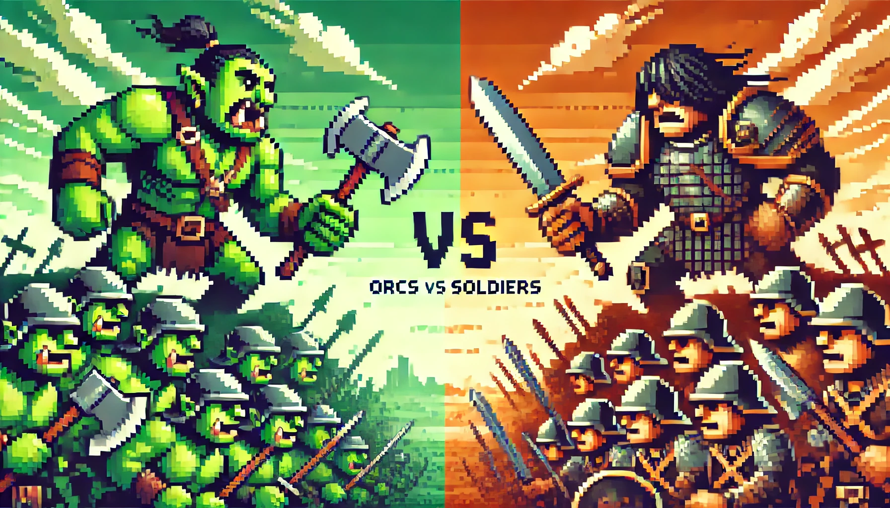
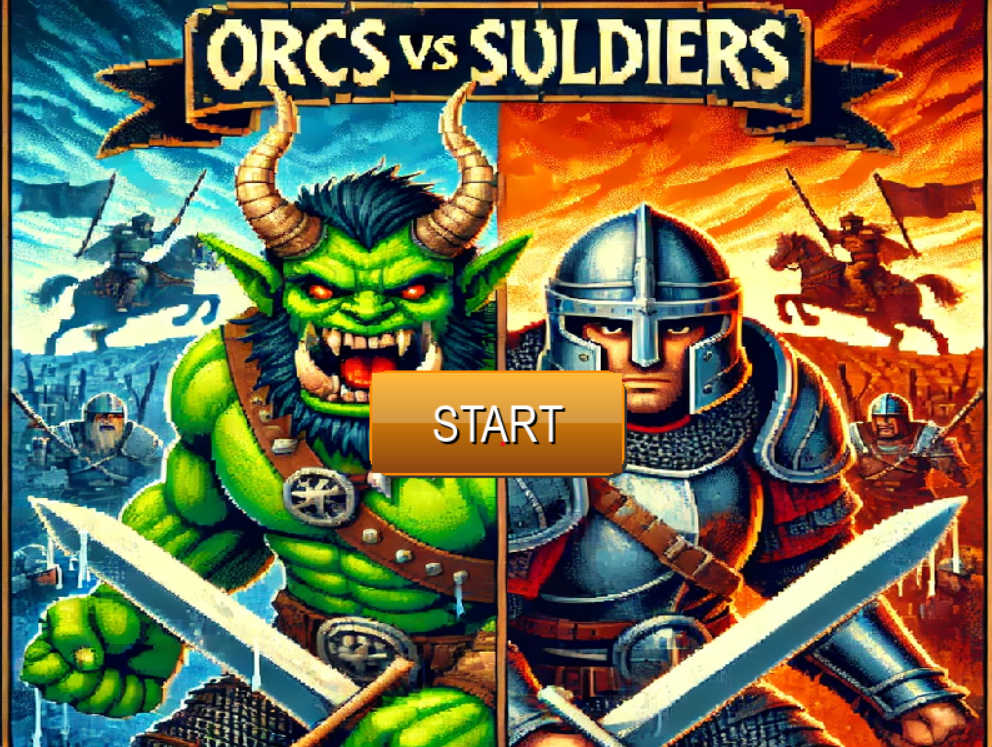
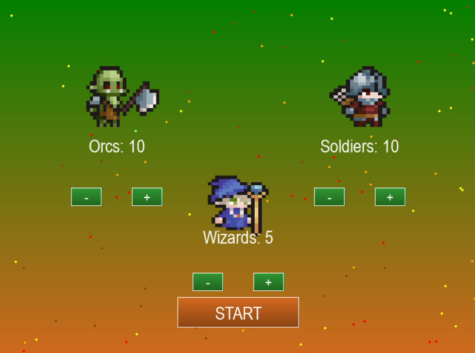
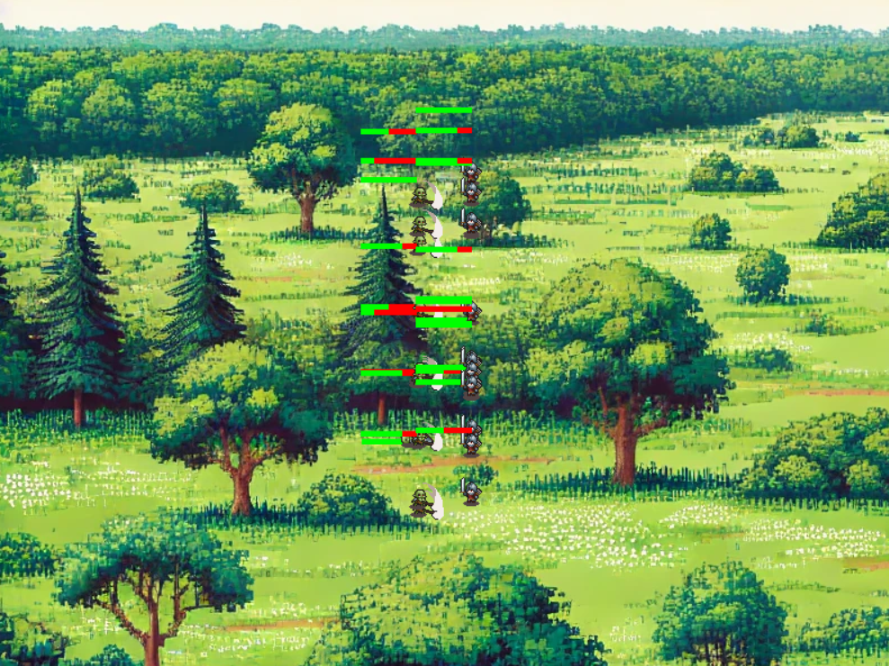

# **Orcs vs Soldiers**

 

**Orcs vs Soldiers** is a real-time strategy simulation game where players observe the battle dynamics between two opposing factions: the mighty **Orcs** and the brave **Soldiers**. Customize the size of each army, sit back, and watch the epic conflict unfold.

---

## **Features**

- **Faction Customization**: Players can select the size of each faction using an interactive slider system.
- **Dynamic AI Combat**: Both factions employ AI to locate, attack, and defeat their nearest enemies.
- **Immersive Visual Effects**: Includes smooth animations for movement, attacking, and death.
- **Interactive Backgrounds**: Features a dynamic gradient backdrop with moving stars to enhance the visual experience.
- **Victory Screen**: The game declares a winner with a themed animation and modernized UI elements.
- **Gradient Buttons**: Enhanced button visuals for customization and starting the game.

---

## **Gameplay Mechanics**

1. **Unit Customization**: Choose the number of Orcs and Soldiers (1–50 each).
2. **AI Movement and Combat**:
   - Each unit targets the nearest enemy and attacks with a set damage value.
   - Units stop to fight but resume moving once the nearest enemy is defeated.
   - Damage increases if a unit kills an enemy.
3. **Victory Conditions**: The simulation ends when one faction is completely eliminated, with a victory message for the winning team.

---

## **Screens and Interactions**

### **1. Start Screen**

 

- Features a **Start** button styled with a gradient from **orange** to **brown**.
- The button becomes more vibrant on hover.

---

### **2. Unit Selection Screen**

 

- Players adjust the size of each faction using the `+` and `-` buttons.
- Displays idle sprites for both **Orcs** and **Soldiers** for easy identification.
- Displays a beautiful gradient backdrop with animated stars.

---

### **3. Battle Simulation**

 

- **Orcs** and **Soldiers** move on the battlefield, seeking out their nearest enemies.
- Includes smooth animations for:
  - Walking
  - Attacking
  - Dying 
- A health bar is displayed above each unit for real-time updates.

---

## **Visuals and Effects**

- **Gradient Background**: A smooth transition between **green** and **orange-brown** tones.
- **Dynamic Stars**: Colorful (red, yellow, orange, brown) particles that move randomly in the background.
- **Modern Buttons**: Styled with gradients and hover effects, enhancing the UI experience.

---

### **Videos**

1. **Gameplay Orcs win**
   
https://github.com/user-attachments/assets/3ac2416b-ec87-4ffa-a2b8-2cf092f1d37e

2. **Gameplay Soldiers win** 
   
https://github.com/user-attachments/assets/a52834a7-d94d-4bd1-9e6d-37bb9de6aa36

