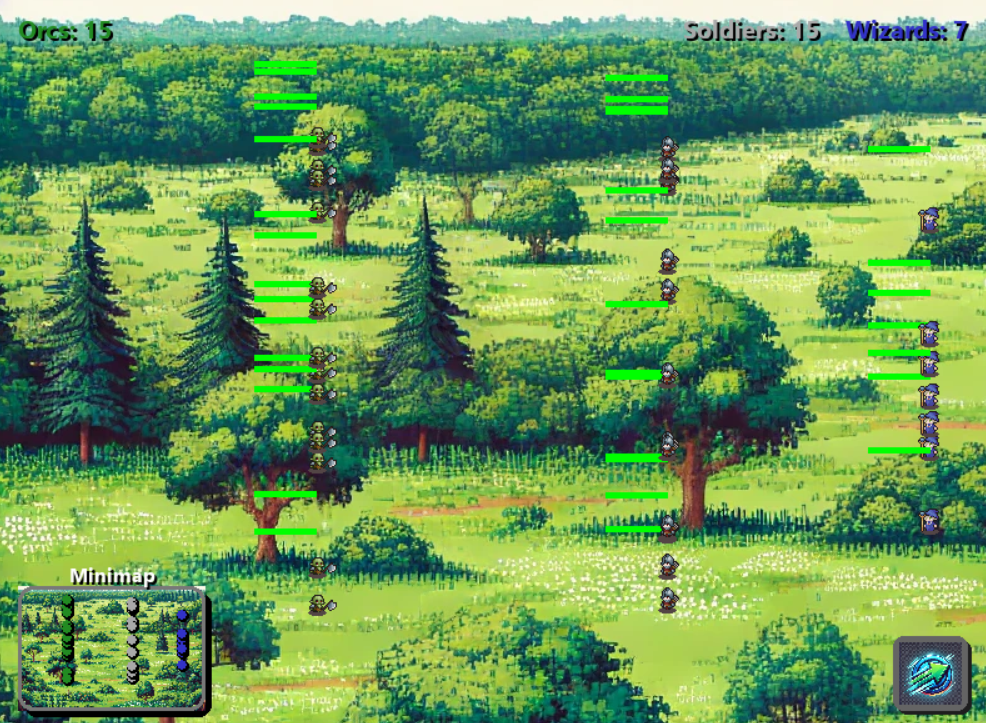

# **Orcs vs Soldiers**


**Orcs vs Soldiers** is a real-time strategy simulation game where players observe the battle dynamics between two opposing factions: the mighty **Orcs** and the brave **Soldiers**. Customize the size of each army, sit back, and watch the epic conflict unfold.

---

## **Features**

- **Faction Customization**: Players can select the size of each faction using an interactive slider system.
- **Dynamic AI Combat**: Both factions employ AI to locate, attack, and defeat their nearest enemies.
- **Immersive Visual Effects**: Includes smooth animations for movement, attacking, and death.
- **Interactive Backgrounds**: Features a dynamic gradient backdrop with moving stars to enhance the visual experience.
- **Victory Screen**: The game declares a winner with a themed animation and modernized UI elements.
- **Gradient Buttons**: Enhanced button visuals for customization and starting the game.
- **Speed Control**: A Speed-Up button allows players to toggle between normal and fast-paced battles.
- **Minimap Display**: A minimap shows real-time positions of all units for strategic overview.
- **New Wizards for Soldiers**: The Soldiers faction now includes powerful blue-robed wizards casting magical spells.

---

## **Gameplay Mechanics**

1. **Unit Customization**: Choose the number of Orcs and Soldiers (1–50 each) and Wizards (1–10).
2. **AI Movement and Combat**:
    - Each unit targets the nearest enemy and attacks with a set damage value.
    - Units stop to fight but resume moving once the nearest enemy is defeated.
    - Damage increases if a unit kills an enemy.
    - **Wizards** cast spells from a distance with magical projectiles.
3. **Victory Conditions**: The simulation ends when one faction is completely eliminated, with a victory message and animation for the winning team.

---

## **Installation and Running the Game**

### **Prerequisites**
- Python 
- Pygame Library

### **Installation Steps**
1. Clone the repository:
    ```bash
    git clone https://github.com/Alexandruasu/Orcs-vs-Soldiers.git
    ```
2. Navigate to the project directory:
    ```bash
    cd Orcs-vs-Soldiers
    ```
3. Install dependencies:
    ```bash
    pip install pygame
    ```
4. Run the game:
    ```bash
    python main.py
    ```

---

## **File Structure**

```
.
├── assets/                # Images and sprites for characters and backgrounds
├── battle.py              # Handles the AI logic for battles between factions
├── button.py              # Manages the Speed-Up button functionality and visuals
├── entities.py            # Defines the Character and Wizard classes, including animations and behaviors
├── main.py                # Main game loop and initialization of game settings
├── minimap.py             # Draws the minimap with real-time unit tracking
├── selection_screen.py    # Manages the UI for selecting the number of units
├── settings.py            # Screen size and FPS settings
├── sprites.py             # Loads and handles sprite sheets for animations
├── start_screen.py        # Displays the game's start screen with animations
├── stylized_button.py     # Utility for creating modern, gradient-styled buttons
├── victory_screen.py      # Displays the victory screen with animations and messages
├── README.md              # Game documentation
└── images/                # Contains images for the README (e.g., screenshots, banners)
```

---

## **Screens and Interactions**

### **1. Start Screen**


- Features a **Start** button styled with a gradient from **orange** to **brown**.
- The button becomes more vibrant on hover and initiates the game upon click.

---

### **2. Unit Selection Screen**


- Players adjust the size of each faction using the `+` and `-` buttons.
- Displays idle sprites for **Orcs**, **Soldiers**, and **Wizards** for easy identification.
- Features a dynamic starry background with a gradient from **green** to **brown**.
- Long-pressing the increment buttons speeds up unit selection.

---

### **3. Battle Simulation**



- **Orcs**, **Soldiers**, and **Wizards** move on the battlefield, targeting and attacking their nearest enemies.
- Smooth animations for:
    - Walking
    - Attacking
    - Dying
- A health bar is displayed above each unit for real-time updates.
- **Wizards** cast magical projectiles that explode on impact.
- **Speed-Up Button** allows toggling between normal and fast game speeds.
- **Minimap** in the bottom-left corner shows real-time positions of all units.

---

## **Visuals and Effects**

- **Gradient Background**: Smooth transitions between **green** and **orange-brown** tones.
- **Dynamic Stars**: Colorful (red, yellow, orange, brown) particles move randomly in the background.
- **Modern Buttons**: Styled with gradients, hover effects, and glossy finishes.
- **Updated Soldier Visuals**: Soldiers now include wizards, adding magical effects to battles.
- **Explosion Effects**: Wizard projectiles explode upon hitting enemies with vibrant animations.

---

## **Updates**

### **New Features in Latest Update**

1. **Wizards for the Soldiers Team**
    - Wizards cast spells from a distance, adding a new layer of strategy.
    - Their magical projectiles create explosions, dealing area damage.

2. **Minimap Addition**
    - A minimap provides a real-time overview of all units on the battlefield.

3. **Speed Control Button**
    - Players can toggle between normal and fast game speeds for quicker battles.

4. **Improved Selection Screen**
    - Added animations and long-press functionality for faster unit selection.

---

## **Videos After Update**

1. **Updated Gameplay: Orcs win**
    
    https://github.com/user-attachments/assets/e3cbe365-bf5f-4502-ad24-074fee22bf1a

2. **Updated Gameplay: Soldiers win**
    
    https://github.com/user-attachments/assets/8a435321-c2cb-433d-8dee-6495eb7490c8

---

## **Old Videos (Before Changes)**

1. **Gameplay Orcs win**
    
    https://github.com/user-attachments/assets/3ac2416b-ec87-4ffa-a2b8-2cf092f1d37e

2. **Gameplay Soldiers win**
    
    https://github.com/user-attachments/assets/a52834a7-d94d-4bd1-9e6d-37bb9de6aa36

---

## **License**

This project is licensed under the MIT License — see the [LICENSE](LICENSE) file for details.
